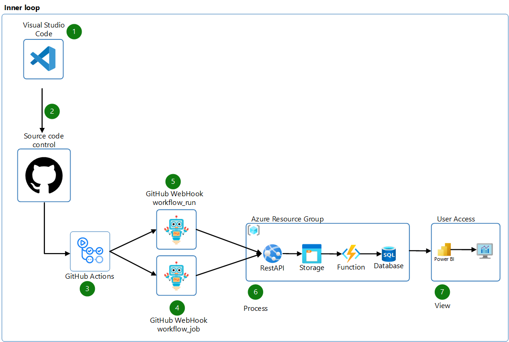

# GitHub Actions Dashboard

This repository contains an example of how to extract workflow execution data and create dashboards. The data is extracted from the GitHub Actions using WebHook and saved in a SQL Server database.

## How it works?

1. Developer works on a GitHub repository.
1. Developer commits code to a repository.
1. GitHub triggers the GitHub Actions workflow.
1. GitHub Actions sends the `workflow_job` events to the API.
1. GitHub Actions sends the `workflow_run` events to the API.
1. The API sends the JSON data to the Azure Blob Storage. The Azure Function reads the data from the Azure Blob Storage, process the JSON and saves it in the SQL Server database.
1. The user accesses the Power BI dashboard to view the data.

## Dashboards samples

### Overview

### Runners view

### Reusable view

### Duration view

## How to deploy

### Step 01 - Create Azure Resources

Create GitHub secrets for Azure Login (`AZ_CREDENTIALS`) and SQL Server password (`AZ_SQL_PASSWORD`).

To create the Azure resources, you can update the variables values and run the workflow [01-CreateAzureResources.yml](.github/workflows/01-CreateAzureResources.yml).

### Step 02 - Deploy the API

To deploy the API that receives the webhook payload, you can run the workflow [02-Deployment-API.yml](.github/workflows/02-Deployment-API.yml).

### Step 03 - Deploy the Azure Function

Create GitHub secrets for SQL Server Connection String (`AZ_SQL_CONNECTION_STRING`). created at [**Step 01**](#step-01---create-azure-resources).

To deploy the Azure Function, you can run the workflow [03-Deployment-Function.yml](.github/workflows/03-Deployment-Function.yml).

### Step 04 - Configure the GitHub Webhook

Create a GitHub Webhook to send the `workflow_job` and `workflow_run` events to the API endpoint.

To create the webhook, at the Organization level, click on **`Settings`**, select the **`Webhooks`** menu, and click on the **`Add webhook`** button.

In the `Payload URL` field, enter the API endpoint created at [**Step 02**](#step-02---deploy-the-api).

In the `Which events would you like to trigger this webhook?` section, select `Let me select individual events` and select the **`workflow_job`** and **`workflow_run`** events.

In the end, you will have two webhooks:
- `workflow_job` event configured to the API endpoint https://[APPNAME].azurewebsites.net/api/GitHubWorkflowJob.
- `workflow_run` event configured to the API endpoint https://[APPNAME].azurewebsites.net/api/GitHubWorkflowRun.

### Step 05 - Deploy the Power BI Dashboard

Update the Power BI file [GitHubActionsDashboard.pbix](dashboard/GitHubDashboard.pbix) with the parameters for connection string and database name.

Upload the Power BI file to your Power BI Service.

## Contributing

If you want to contribute to this project, please read the [CONTRIBUTING](CONTRIBUTING.md) file.

## License

This project is licensed under the MIT License - see the [LICENSE](LICENSE.md) file for details.
